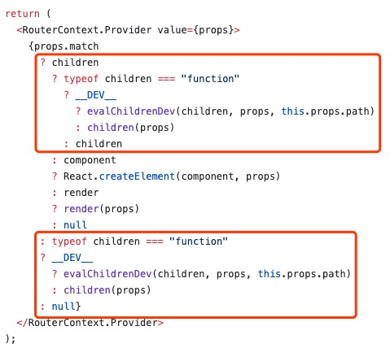

# react-cache-router

基于`react`v16和`react-router-dom`v4实现的路由缓存功能

搭配`react-router-dom`v4以上进行工作

## 安装

```text
# 使用npm安装
npm install react-cache-router --save
# 或者使用yarn
yarn add react-cache-router
```

## 为何实现

在使用`vue-router`时，只要使用`keep-alive`组件包裹，便能将在路由发生改变时，将组件状态记录下来。

而在使用`react-router`时，发现`react`并没`keep-alive`组件，`route`也没有提供缓存组件状态的方法，导致每次路由回退时，当前路由下的数据和滚动位置丢失。

`react-cache-router`就是为了实现`react-router`的`keep-alive`功能。

[DEMO演示]: https://codesandbox.io/s/react-cache-router-demo-on6fg

## 实现原理

我们利用了`react-router`中，无论当前路由是否匹配，children永远不会被卸载的原理



## 使用方法

提供了`CacheSwitch`和`CacheRoute`，只要替换掉原本的`react-router-dom`提供的`Switch`和`Route`即可使用。

`CacheSwitch`和`CacheRoute`是互相依赖，没办法单独使用。

```typescript jsx
import * as React from 'react';
import {HashRouter} from 'react-router-dom';
import {CacheSwitch, CacheRoute} from 'react-cache-router';

export class App extends React.Component{
    render(){
        return <HashRouter>
            <CacheSwitch>
                <CacheRoute path="home" component={}/>
            </CacheSwitch>
        </HashRouter>;
    }
}
```